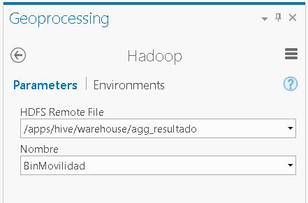

## Movilidad

En este escenario se describe la integración de información desde el SIG hacia la infraestructura Hortonworks. En este escenario para realizar las operaciones espaciales usando Hive se cuenta con:

* Unidad Administrativa: Se refiere al feature class de Barrios, el cual se requiere para realizar las agregaciones.
* Herramientas para la conversión de datos a formato JSON (formato soportado de forma nativa por Hive)
* Modelo de Geoprocesamiento para que usando ArcGIS Pro, automatizar los procesos e integrar las herramientas.

# Transformación de FeatureClass JSON y copia a  HDFS


Como parte de la integración hacia Hadoop las herramientas permiten desde ArcGIS Pro, realizar la conversión de Información desde un formato geográfico (FeatureClass) a un formato JSON, el cual puede ser utilizado en Hadoop para ser procesado.  Siga los siguientes pasos para realizar la transformación y copiado del Feature Class Barrio.

1. Para realizar el copiado, previamente debe existir la carpeta donde reposará la información.  En al caso que no extista deberá ejecutar los siguientes comando por consola en el nodo de Hadoop:

 		#Crear la carpeta si es necesario.
 		hadoop fs -mkdir movilidad
        hadoop fs -mkdir movilidad/data
        
2. Utilizando la Caja de Herramientas BigData.tbx, ejecute el modelo "FC2JSON2HDFS (Movilidad)"

 

   Especifique los parámetros:
   
   []FC: Feature Class que será transformado a JSON
   []Barrios.json: Archivo JSON resultado de la transformación a formato JSON
   []HDFS Server Hostname: sandbox.hortonworks.com
   []HDFS TCP Port Number: 50070
   []HDFS Username: root
   []HDFS Remote File: /user/root/movilidad/data/Barrios.json
   
   

3. Como resultado podrá verificar que la información es copiada.  Use el siguiente vinculo para verificar que la informacion es cargada.

	http://sandbox.hortonworks.com:50070/explorer.html#/user/root/movilidad/data

	
	
Como resultado de este proceso se realizó la integración de información con HDFS.

# Agregación de Datos en Formato CSV en Cluster de Comportamiento.

En este ejemplo se tienen en cuenta datos de recorridos de vehiculos en un intervalo de tiempo definido. 

Cree un directorio en Hadoop si no existe previamente, utilizando linea de comando.

```bash
	hadoop fs -mkdir movilidad
    hadoop fs -mkdir movilidad/data
    hadoop fs -mkdir movilidad/data/2016-02
```

Utilizando el modelo descrito anteriormente copie el archivo **movilidad-2016-02-09-vel.csv**
En el caso que los datos esten en archivo en el nodo de Hadoop use el comando siguiente para copiarlos a HDFS

```bash
hadoop fs -put data/2016-02  movilidad/data
```

Inicie la consola de comandos Hive.

> **Nota**: Si tiene algun problema con Hive vea [aqui](https://github.com/Esri/spatial-framework-for-hadoop/wiki/ST_Geometry-for-Hive-Compatibility-with-Hive-Versions) la lista completa de las compatibilidades con ST_Geometry.

```bash
# use '-S' para modo silencioso
hive
```

> Este ejemplo asume que Hive esta instalado en un cluster Local. Si usted esta usando un cluster remoto, necesitará mover los archivos a HDFS y cambiar la tabla de definiciones como sea requerido.

Adicione las librerias externas requeridas para la creacion de las funciones temporales para los llamados del API.
```bash
add jar
    gis-tools-for-hadoop/samples/lib/esri-geometry-api.jar
    gis-tools-for-hadoop/samples/lib/spatial-sdk-hadoop.jar;
create temporary function ST_Bin as 'com.esri.hadoop.hive.ST_Bin';
create temporary function ST_Point as 'com.esri.hadoop.hive.ST_Point';
create temporary function ST_BinEnvelope as 'com.esri.hadoop.hive.ST_BinEnvelope';
create temporary function ST_Contains as 'com.esri.hadoop.hive.ST_Contains';

```

> Esta es una implementacion mínima de funciones ST_Geometry que se encuentran en [Hive Spatial Library](https://github.com/Esri/spatial-framework-for-hadoop/wiki/Hive-Spatial).  El listado de funciones disponibles en [linked repository](https://github.com/Esri/spatial-framework-for-hadoop/wiki/UDF-Documentation).


Elimine la tabla M01 si existe:
```bash
drop table M01;
```
Defina el esque para para la creacion de la tabla.  Los datos estan almacenados en formato CSV (valores separados por coma), el cual esta soportado por Hive de forma Nativa.


```sql
CREATE TABLE m01 (id string,booking_id string,driver_id string,created_at string,latitude DOUBLE,longitude DOUBLE,d DOUBLE,t DOUBLE,v DOUBLE)
ROW FORMAT DELIMITED FIELDS TERMINATED BY ','
STORED AS TEXTFILE;
```

Cargue los datos en la tabla:
```sql
LOAD DATA INPATH 'movilidad/data/2016-02/movilidad-2016-02-09-vel.csv' OVERWRITE INTO TABLE M01; 
```

Cree la tabla donde se almacenará el resultado del análisis.

Elimine la tabla de resultados de existir:
```sql
DROP TABLE agg_resultado;
```

```sql
CREATE TABLE agg_resultado(area binary, count double,v double)
ROW FORMAT SERDE 'com.esri.hadoop.hive.serde.JsonSerde'              
STORED AS INPUTFORMAT 'com.esri.json.hadoop.EnclosedJsonInputFormat'
OUTPUTFORMAT 'org.apache.hadoop.hive.ql.io.HiveIgnoreKeyTextOutputFormat';
```


Ejecute el Análisis de cluster:
```sql
FROM (SELECT ST_Bin(0.001, ST_Point(longitude, latitude)) bin_id, * FROM m01) bins
INSERT OVERWRITE TABLE agg_resultado
SELECT ST_BinEnvelope(0.001, bin_id) shape, count(*) count, avg(v) v
GROUP BY bin_id;
```
Una vez se ejecuta el comando Hive, se inicia el proceso como se muestra en la imagen


Terminado el proceso se ha creado el resultado en la tabla **agg_resultado** en el directorio /apps/hive/warehouse/agg_resultado.


##Cargue de Información en ArcGIS Pro
Para visualizar la información una vez procesada por Hadoop, debe usarse las herramientas de geoprocesamiento CopyFromHDFS, el cual se encarga de copiar los datos procesados en Hive , almacenados en HDFS a un Feature Class.  Como parte del escenario el siguiente es un Modelo de Geoprocesarimiento que integra la herramienta. 


Ejecute el modelo de Geoprocesamiento


Verifique los parámetros del modelo: 

  
   []Nombre FeatureClass: ClusterMovilidad
   []HDFS Remote File: /apps/hive/warehouse/agg_resultado
   
> **Nota**: Los parámetros de conexion al Cluster Hadoop estan especificados en el modelo. De requerirse cambiarlos estos deben ser modificados en el modelo.



Adicione el resultado del Modelo en ArcGIS Pro, y clasefiquelos por los campos tanto "count", o "v", correspondiente a las velocidades promedio. Utilice las capacidades que ofrece ArcGIS Pro para simbolozarlos. 


# Agregación de Datos Formato CSV en Polígonos.
En este ejemplo se tienen en cuenta datos de recorridos de vehiculos en un intervalo de tiempo definido, y areas administrativas (Barrios) que serán usados para la agregación.

Cree un directorio en Hadoop si no existe previamente, utilizando linea de comando.

```bash
	hadoop fs -mkdir movilidad
    hadoop fs -mkdir movilidad/data
    hadoop fs -mkdir movilidad/data/2016-02
```

Utilizando el modelo descrito anteriormente copie el archivo **movilidad-2016-02-09-vel.csv**
En el caso que los datos esten en archivo en el nodo de Hadoop use el comando siguiente para copiarlos a HDFS

```bash
hadoop fs -put data/2016-02  movilidad/data
```

Inicie la consola de comandos Hive.

> **Nota**: Si tiene algun problema con Hive vea [aqui](https://github.com/Esri/spatial-framework-for-hadoop/wiki/ST_Geometry-for-Hive-Compatibility-with-Hive-Versions) la lista completa de las compatibilidades con ST_Geometry.

```bash
# use '-S' para modo silencioso
hive
```

> Este ejemplo asume que Hive esta instalado en un cluster Local. Si usted esta usando un cluster remoto, necesitará mover los archivos a HDFS y cambiar la tabla de definiciones como sea requerido.

Adicione las librerias externas requeridas para la creacion de las funciones temporales para los llamados del API.
```bash
add jar
    gis-tools-for-hadoop/samples/lib/esri-geometry-api.jar
    gis-tools-for-hadoop/samples/lib/spatial-sdk-hadoop.jar;
create temporary function ST_Bin as 'com.esri.hadoop.hive.ST_Bin';
create temporary function ST_Point as 'com.esri.hadoop.hive.ST_Point';
create temporary function ST_BinEnvelope as 'com.esri.hadoop.hive.ST_BinEnvelope';
create temporary function ST_Contains as 'com.esri.hadoop.hive.ST_Contains';

```

> Esta es una implementacion mínima de funciones ST_Geometry que se encuentran en [Hive Spatial Library](https://github.com/Esri/spatial-framework-for-hadoop/wiki/Hive-Spatial).  El listado de funciones disponibles en [linked repository](https://github.com/Esri/spatial-framework-for-hadoop/wiki/UDF-Documentation).


Elimine la tabla M01 si existe:
```bash
drop table M01;
```
Defina el esquema para para la creacion de la tabla.  Los datos estan almacenados en formato CSV (valores separados por coma), el cual esta soportado por Hive de forma Nativa.


```sql
CREATE TABLE m01 (id string,booking_id string,driver_id string,created_at string,latitude DOUBLE,longitude DOUBLE,d DOUBLE,t DOUBLE,v DOUBLE)
ROW FORMAT DELIMITED FIELDS TERMINATED BY ','
STORED AS TEXTFILE;
```

Cargue los datos en la tabla:
```sql
LOAD DATA INPATH 'movilidad/data/2016-02/movilidad-2016-02-09-vel.csv' OVERWRITE INTO TABLE M01; 
```

Defina la tabla que almacenará los Barrios


Cree la tabla donde se almacenará el resultado del análisis.

Elimine la tabla de resultados de existir:
```sql
DROP TABLE agg_resultado;
```

```sql
CREATE TABLE agg_resultado(area binary, count double,v double)
ROW FORMAT SERDE 'com.esri.hadoop.hive.serde.JsonSerde'              
STORED AS INPUTFORMAT 'com.esri.json.hadoop.EnclosedJsonInputFormat'
OUTPUTFORMAT 'org.apache.hadoop.hive.ql.io.HiveIgnoreKeyTextOutputFormat';
```


Ejecute el Análisis de cluster:
```sql
FROM (SELECT ST_Bin(0.001, ST_Point(longitude, latitude)) bin_id, * FROM m01) bins
INSERT OVERWRITE TABLE agg_resultado
SELECT ST_BinEnvelope(0.001, bin_id) shape, count(*) count, avg(v) v
GROUP BY bin_id;
```
Una vez se ejecuta el comando Hive, se inicia el proceso como se muestra en la imagen


